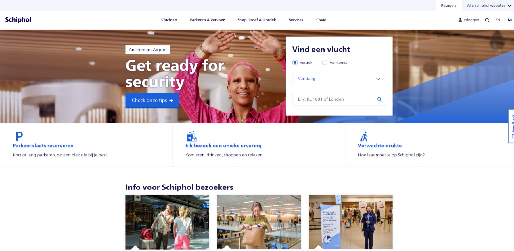
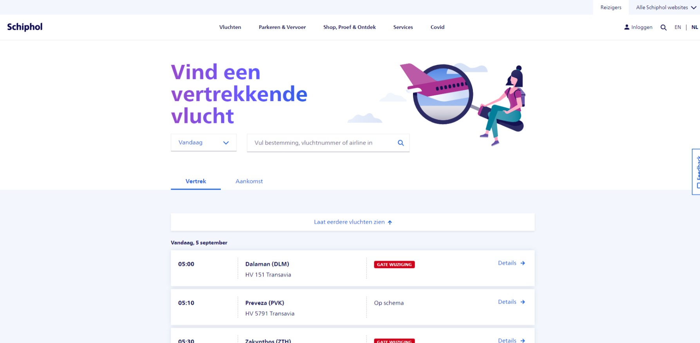

# Procesverslag
Markdown is een simpele manier om HTML te schrijven.  
Markdown cheat cheet: [Hulp bij het schrijven van Markdown](https://github.com/adam-p/markdown-here/wiki/Markdown-Cheatsheet).

Nb. De standaardstructuur en de spartaanse opmaak van de README.md zijn helemaal prima. Het gaat om de inhoud van je procesverslag. Besteedt de tijd voor pracht en praal aan je website.

Nb. Door *open* toe te voegen aan een *details* element kun je deze standaard open zetten. Fijn om dat steeds voor de relevante stuk(ken) te doen.

## Jij

  
uitwerken voor kick-off werkgroep

  ### Auteur:
  Maxwell Pels

  #### Je startniveau:
  Rood

  #### Je focus:
  Responsive (en surfaceplane)
 

## Je website

  
uitwerken voor kick-off werkgroep

  ### Je opdracht:
  https://www.schiphol.nl/

#### Screenshot(s) van de eerste pagina (small screen): 
  Home  
  

  #### Screenshot(s) van de eerste pagina (small screen): 
  Vertrek  
  

  #### Screenshot(s) van de eerste pagina (full screen): 
  Home  
  

  #### Screenshot(s) van de tweede pagina (full screen):
  Vertrek  
  
 

## Toegankelijkheidstest 1/2 (week 1)

  
uitwerken na test in 2e werkgroep

  ### Bevindingen
  Lijst met je bevindingen die in de test naar voren kwamen:

  <ol>
   <li>Veel errors</li>
   <li>Toegankelijkheid is top</li>
  </ol>

## Breakdownschets (week 1)

  
uitwerken na afloop 3e werkgroep

  ### de hele pagina: 
  

  

## Voortgang 1 (week 2)

  
uitwerken voor 1e voortgang

  ### Stand van zaken
  Uitvinden hoe grid precies werkt vond ik nog best ingewikkeld, omdat het allemaal nieuw was. Hiervoor gebruikte ik alleen flexbox. Dus het was een hele andere manier van denken.

  ### Agenda voor meeting
  samen met je groepje opstellen

  Evi: 
  - positioneren
  - gridof flex
  - hamburgermenu

  Melvin:
  - Hamburgermenu
  - plaatjes

  Maxwell:
  - hamburgermenu
  - grid of flex

  Sinem:
  - ...
  

  ### Verslag van meeting
  hier na afloop snel de uitkomsten van de meeting vastleggen

  - nav beter uitwerken
  - niet alles in divs en sections plaatsen zonder goede reden

## Voortgang 2 (week 3)

  
uitwerken voor 2e voortgang

  ### Stand van zaken
  Ik heb er niet veel aan gewerkt, dus had niet echt iets om feedback over e krijgen.

  ### Agenda voor meeting
  Maxwell:
  - 

  ### Verslag van meeting
  hier na afloop snel de uitkomsten van de meeting vastleggen

  - 

## Toegankelijkheidstest 2/2 (week 4)

  
uitwerken na test in 9e werkgroep

  ### Bevindingen
  Ik heb de hover-state en outline als je met tab erover heen gaat verbeterd.
  Dit kwamen uit de lijst van de toegankelijkheidstest. De voiceover werkt ook prima.

  Als ik meer tijd heb wil ik graag een dark mode maken, wat niet heel ingewikkeld lijkt.

## Voortgang 3 (week 4)

  
uitwerken voor 3e voortgang

  ### Stand van zaken
  Het is gelukt om grid erin te verwerken, maar niet significant veel. Daarnaast vormgeving aanzienlijk verbetrd, maar kon de tekst niet in het kader houden.

  
  
  

  ### Agenda voor meeting

  - Helaas niet aanwezig door andere les (UCD). Wel gevraagd naar belangrijke onderdelen die terug moeten komen in de website en waar je vooral op wordt beoordeeld.

## Eindgesprek (week 5)

  
uitwerken voor eindgesprek

  ### Je uitkomst - karakteristiek screenshots:
  
  

  ### Dit ging goed/Heb ik geleerd: 
  Het beheersen van grid en aanpassen. Vormgeving van elementen ging sneller / heb ik beter begrepen dan daarvoor.

  
  

  ### Dit was lastig/Is niet gelukt:
  Als ik meer tijd had, zou ik beter de position property kunnen toepassen en de website echt identiek maken als het origineel.

  Als ik meer tijd had wilde ik graag een dark mode maken, wat niet heel ingewikkeld leek.

  Bij section 3 is het niet gelukt om de border werkend te krijgen zodat het niet van vorm veranderd als je er over heen hoverd.

  Animaties wilde ik graag toevoegen, maar door tijd gebrek helaas niet gelukt.

  Tweede pagina afgerafeld, vanwege tijdgedrek :(

  

## Bronnenlijst

  
continu bijhouden terwijl je werkt

  Nb. Wees specifiek ('css-tricks' als bron is bijv. niet specifiek genoeg). 
  Nb. ChatGpT en andere AI horen er ook bij.
  Nb. Vermeld de bronnen ook in je code.

  1. css-tricks:
  - Grid <a href="https://css-tricks.com/snippets/css/complete-guide-grid/">https://css-tricks.com/snippets/css/complete-guide-grid/</a>
  - Flexbox <a href="https://css-tricks.com/snippets/css/a-guide-to-flexbox/">https://css-tricks.com/snippets/css/a-guide-to-flexbox/</a>

  2. Youtube:
  - Kevin Powell: Clip an image to text with CSS <a href="https://www.youtube.com/watch?v=9Kr3T4Ndl-o&t=5s">https://www.youtube.com/watch?v=9Kr3T4Ndl-o&t=5s</a>
  - Kevin Powell: CSS Positioning: Position absolute and relative explained <a href="https://www.youtube.com/watch?v=P6UgYq3J3Qs&t=135s">https://www.youtube.com/watch?v=P6UgYq3J3Qs&t=135s</a>
  - Kevin Powell: Width & Height vs. Positioning properies (top, right, bottom, left) <a href="https://www.youtube.com/watch?v=QGKO0PGzFXQ">https://www.youtube.com/watch?v=QGKO0PGzFXQ</a>
  - Jesse Showalter: Making Modern Layouts with CSS Grid | CSS Grid Basics <a href="https://www.youtube.com/watch?v=br-0i3U1VCA&t=433s">https://www.youtube.com/watch?v=br-0i3U1VCA&t=433s</a>

  3. MDN:
  - Anchor tag <a href="https://developer.mozilla.org/en-US/docs/Web/HTML/Element/a">https://developer.mozilla.org/en-US/docs/Web/HTML/Element/a</a>
  - Article tag <a href="https://developer.mozilla.org/en-US/docs/Web/HTML/Element/article">https://developer.mozilla.org/en-US/docs/Web/HTML/Element/article</a>
  - Section tag <a href="https://developer.mozilla.org/en-US/docs/Web/HTML/Element/section">https://developer.mozilla.org/en-US/docs/Web/HTML/Element/section</a>
  - Div tag <a href="https://developer.mozilla.org/en-US/docs/Web/HTML/Element/div">https://developer.mozilla.org/en-US/docs/Web/HTML/Element/div</a>
  - Form tag <a href="https://developer.mozilla.org/en-US/docs/Web/HTML/Element/form">https://developer.mozilla.org/en-US/docs/Web/HTML/Element/form</a>

